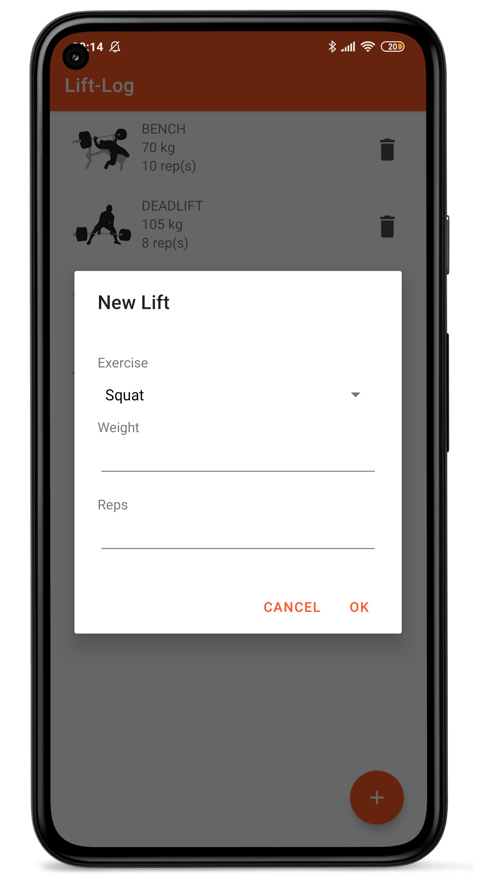

# LiftEatLog

## Leírás
Az applikáció célja erőemelő sportolók teljesítményének nyilvántartása, valamint optimalizálása.
Erőemelő versenyen a sportolók három gyakorlatban versenyeznek guggolásban, emelésben,
valamint fekvenyomásban. Ez a program képes nyilvántartani egy edzés vagy verseny során ezen
három gyakorlaton nyújtott teljesítményét a sportolónak, kalkulátorokkal, és diagrammokkal,
valamint hasznos receptekkel könnyítve a sportoló fejlődését.

## Felhasznált technológiák

- Preszistens adattároás SQLite
- Room absztakciós réteg SQlite felett
- TheMealDB API hanszálata receptek lekérésére
- MPAndroidChart a diagram megjelenítésére
- Retrofit az API által nyújtott adatok feldolgozására
- Glide az API által nyújtott képek megjelenítése
- Implicit intent youtube videó lejátszáshoz
- A listát megvallósító képernyő optimalizált álló és fekvő nézetre is
- Recycleview tárolt adatok megjelenítésére
- DialogFragment adatok bekérésére

## Funkciók bemutatása

### Menu

### API

    
    

### List

    
    

### Chart and Calculator

    
    

